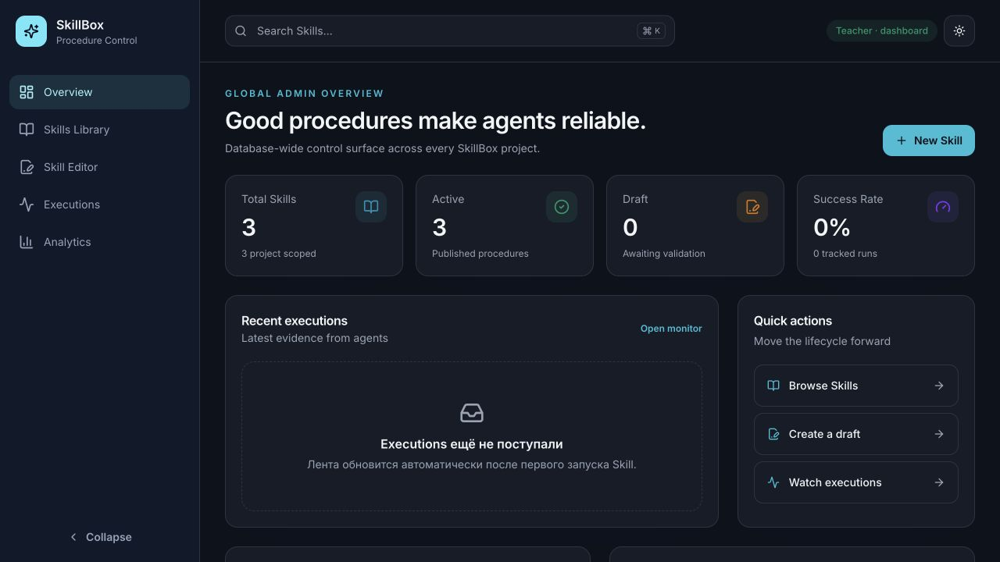
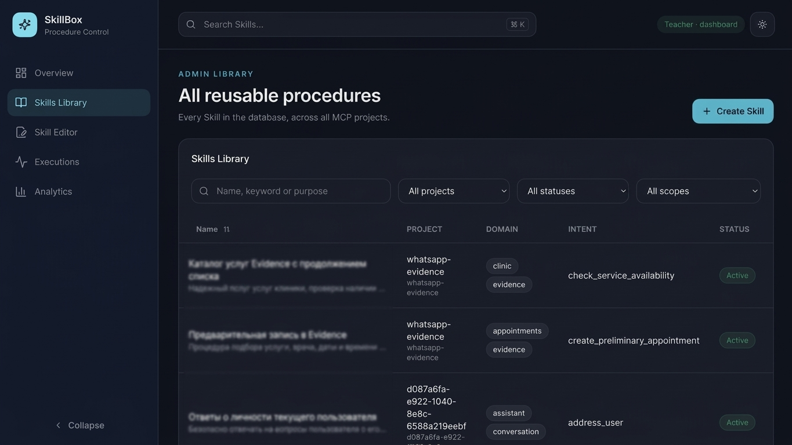

# SkillBox

> Процедурная память для AI-агентов через MCP.

[](LICENSE)
[](go.mod)
[](docs/MCP.md)
[](docs/DASHBOARD.md)

[English](README.md) · **Русский**

SkillBox — open-source сервис для хранения, проверки, компиляции и оценки переиспользуемых AI-процедур. Skill описывает:

- когда процедуру нужно применять;
- какой доверенный контекст и инструменты необходимы;
- какие шаги и в каком порядке выполнить;
- по каким критериям результат считается успешным;
- какие ошибки и нежелательное поведение нужно предотвращать.

SkillBox не заменяет LLM или базу знаний. Он добавляет постоянный процедурный слой: успешный рабочий процесс можно сохранить, версионировать, проверить и улучшать, а не изобретать заново в каждом диалоге.

## Зачем нужен SkillBox

Обычные промпты легко копировать, но сложно эксплуатировать как систему. В них обычно нет области действия, требований к инструментам, проверки, версий, доказательств выполнения и механизма выбора только нужной процедуры.

SkillBox превращает процедуры в управляемые записи:

```text
задача
  │
  ├─ найти компактные кандидаты Skills
  ├─ выбрать одну подходящую процедуру
  ├─ скомпилировать её под текущую модель и инструменты
  ├─ выполнить внутри агента
  └─ сохранить результат для дальнейшего улучшения
```

Это особенно полезно для локальных и небольших моделей, которым помогают короткие и явные процедуры. При этом SkillBox не заявляет, что делает небольшую модель равной frontier-модели: эффект нужно измерять на конкретных задачах относительно baseline.

## Возможности

- **MCP-native** — Student и Teacher работают через JSON-RPC по HTTP.
- **Изоляция проектов** — проект задаётся URL и не может быть подменён аргументами модели.
- **Review lifecycle** — draft, validation, proposal, approval/rejection, publication и rollback.
- **Progressive disclosure** — поиск возвращает компактные кандидаты, а подготовка компилирует один Skill.
- **Структурированные процедуры** — шаги, контекст, инструменты, зависимости, примеры и критерии успеха.
- **Доказательства выполнения** — успехи, ошибки, модель, длительность, вызовы инструментов и trajectory.
- **Три БД** — SQLite, MySQL и PostgreSQL.
- **Глобальная админ-панель** — все проекты и Skills в одном Dashboard.
- **Один production-бинарник** — статический Next.js Dashboard встроен в Go через `go:embed`.
- **Портативные релизы** — macOS и Linux, ARM64 и AMD64.

## Админ-панель



*Общие метрики Skills по всей базе, события выполнения и быстрые действия с lifecycle.*



*Поиск и фильтрация Skills из всех MCP-проектов по проекту, статусу и области действия.*

## Архитектура

```text
                                      ┌──────────────────────────────┐
Browser ── GET / ────────────────────>│                              │
Browser ── GET /admin/api/* ─────────>│       SkillBox binary        │──> SQLite
Teacher ── POST /mcp/{project}/teacher│                              │──> MySQL
Student ── POST /mcp/{project} ──────>│  Go API + embedded Dashboard │──> PostgreSQL
                                      └──────────────────────────────┘
```

| Маршрут | Роль | Назначение |
| --- | --- | --- |
| `POST /mcp/{project_id}` | Student | Поиск, подготовка и отчёт о результате Skill |
| `POST /mcp/{project_id}/teacher` | Teacher | Создание, проверка, публикация, аналитика и rollback |

Dashboard видит всю базу, но MCP-клиенты остаются изолированными по проектам.

## Быстрый запуск

### Локальная сборка

Понадобятся Go 1.26+, Node.js 24+ и npm.

```bash
git clone https://github.com/ArturSaleev/SkillBox.git
cd SkillBox
make build
./skillbox -config ./configs/skillbox.yaml
```

Откройте [http://127.0.0.1:8081](http://127.0.0.1:8081).

Node.js нужен только для сборки. Итоговый `skillbox` уже содержит весь Dashboard.

### Docker с постоянной SQLite

```bash
docker compose -f docker-compose.sqlite.yml up --build
```

Именованный Docker volume сохраняет базу между пересозданиями контейнера.

### Проверка MCP

Первый `initialize` атомарно создаёт проект из URL:

```bash
curl -s http://127.0.0.1:8081/mcp/demo \
  -H 'Content-Type: application/json' \
  -d '{"jsonrpc":"2.0","id":1,"method":"initialize","params":{}}'
```

Получить Student-инструменты:

```bash
curl -s http://127.0.0.1:8081/mcp/demo \
  -H 'Content-Type: application/json' \
  -d '{"jsonrpc":"2.0","id":2,"method":"tools/list","params":{}}'
```

В [десятиминутном tutorial](docs/QUICKSTART.md) показан полный путь: создать, проверить, опубликовать, подготовить и оценить первый Skill.

## Жизненный цикл Skill

```text
create draft
    │
    ├─ update draft
    └─ validate
         │
         └─ create proposal
                │
                ├─ reject ──> improve draft
                └─ approve
                     │
                     └─ publish ──> active Skill
                                         │
                                         ├─ report execution evidence
                                         └─ roll back as a new version
```

Создание, изменение, публикация и rollback формируют неизменяемую историю версий. Rollback не удаляет старые версии.

## Конфигурация

```yaml
server:
  address: "127.0.0.1:8081"

database:
  driver: sqlite # sqlite, mysql, postgres
  path: ./data/skillbox.db
  dsn: ""
```

- SQLite использует `path`.
- MySQL и PostgreSQL используют `dsn`.
- Миграции выполняются автоматически при запуске.
- Относительный путь SQLite считается от рабочей директории процесса.

`address: ":8081"` слушает все сетевые интерфейсы. Для локального использования оставляйте `127.0.0.1:8081`.

## Сборка релизов

```bash
./build-release.sh host # текущая платформа
./build-release.sh all  # macOS/Linux, ARM64/AMD64
```

Каждый релиз содержит один исполняемый файл, конфигурацию и документацию:

```text
release/<os>/<arch>/SkillBox/
├── SkillBox
├── configs/skillbox.yaml
├── docs/
└── README.md
```

Существующая release-конфигурация сохраняется при повторной сборке.

## Статус проекта

SkillBox уже работает, но остаётся ранним open-source проектом. Реализованы storage, MCP lifecycle, Dashboard, миграции, релизные сборки и интеграционные тесты. До заявления о production maturity проекту нужны реальные сценарии использования, обратная связь и дополнительные участники.

Важное ограничение: **в SkillBox пока нет встроенной аутентификации**. Не открывайте Student, Teacher или Dashboard напрямую в недоверенную сеть. Используйте локальный bind, защищённый reverse proxy или другой доверенный сетевой периметр.

Планы находятся в [ROADMAP.md](ROADMAP.md), правила безопасного сообщения об уязвимостях — в [SECURITY.md](SECURITY.md).

## Документация

| Раздел | Содержание |
| --- | --- |
| [Quick start](docs/QUICKSTART.md) | Публикация и использование первого Skill |
| [MCP contract](docs/MCP.md) | Маршруты, роли, инструменты и JSON-RPC |
| [Skill model](docs/SKILL_MODEL.md) | Scope, структура, версии и компиляция |
| [Dashboard](docs/DASHBOARD.md) | Встроенная админ-панель |
| [Architecture](docs/ARCHITECTURE.md) | Пакеты, границы доверия и сборка |
| [Database](docs/DATABASE.md) | Схема, драйверы, миграции и backup |
| [Deployment](docs/DEPLOYMENT.md) | Локальный запуск, release и Docker |
| [Community launch](docs/COMMUNITY_LAUNCH.md) | Готовый текст первой дискуссии и launch-checklist |

## Сообщество

Полезный вклад — это не только код. Нужны реальные процедуры, результаты сравнений, UX-feedback, документация, интеграции и отчёты о неудачных сценариях.

- Перед Pull Request прочитайте [CONTRIBUTING.md](CONTRIBUTING.md).
- GitHub Issues используйте для воспроизводимых ошибок и ограниченных feature proposals.
- GitHub Discussions — для вопросов, идей, сценариев и архитектурных разговоров.
- Соблюдайте [Code of Conduct](CODE_OF_CONDUCT.md).

Если вам близка идея проекта, создайте Discussion и расскажите, какой рабочий процесс должен запоминать ваш агент. Это лучший первый вклад.

## FAQ

### SkillBox — это библиотека промптов?

Он может хранить инструкции, но модель шире: triggers, scope, context requirements, tools, steps, dependencies, examples, versions, review и execution evidence.

### SkillBox вызывает LLM и выполняет инструменты?

Нет. Агент получает и компилирует процедуру через SkillBox, а выполняет её собственной моделью и собственными инструментами.

### Это RAG или база знаний?

Нет. База знаний хранит факты и документы. SkillBox хранит процедуры надёжного использования контекста и инструментов. Эти системы дополняют друг друга.

### Может ли модель подменить project ID?

Нет. Scope берётся из `/mcp/{project_id}`, а сервер перезаписывает переданные моделью workspace/project arguments.

### Dashboard запускается отдельно?

Нет. Он статически собирается и встраивается в один Go-бинарник.

### Можно использовать локальные модели?

Да. Протокол не зависит от модели. Сравнивайте результат одной модели с нужным Skill и без него, чтобы измерить реальный эффект.

## Лицензия

[MIT](LICENSE) © 2026 Artur Saleev.
